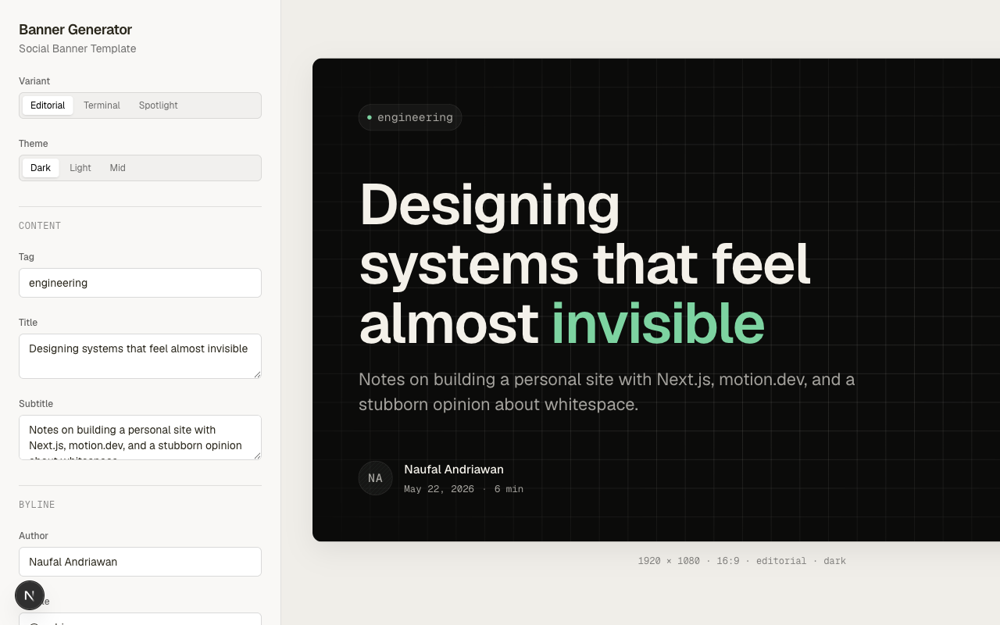

# Banner Blog Maker

A focused Next.js studio for designing, previewing, and exporting blog/social
media banners. It includes an interactive editor, multiple banner variants,
image upload support, client-side exports, and a server-side image generation
API documented with OpenAPI.



## Features

- Interactive banner editor with editorial, terminal, spotlight, and square
  layouts.
- Theme, accent, background, metadata, rounded-corner, and typography controls.
- Export to PNG, WebP, JPG, or PDF from a crisp full-resolution artboard.
- Local browser persistence for the latest editor configuration.
- Server-side `/api/banner` image generation route powered by `next/og`.
- Multipart `/api/upload` route for adding image assets to generated banners.
- OpenAPI contract in `openapi.yml` for API clients and documentation tooling.

## Tech Stack

- Next.js 16 App Router
- React 19
- TypeScript
- Tailwind CSS 4
- `next/og` for server-rendered PNG generation
- `jspdf` for PDF export packaging

## Getting Started

Install dependencies:

```bash
pnpm install
```

Run the development server:

```bash
pnpm dev
```

Open [http://localhost:3000](http://localhost:3000) to use the editor.

## Useful Commands

```bash
pnpm lint
pnpm build
```

## API

Generate a banner image:

```bash
curl -X POST http://localhost:3000/api/banner \
  -H "Content-Type: application/json" \
  -o banner.png \
  -d '{
    "variant": "editorial",
    "theme": "dark",
    "title": "Designing systems that feel almost invisible",
    "subtitle": "Notes on building a personal site.",
    "accent": "#7DD3A1",
    "background": "grid"
  }'
```

See `openapi.yml` for the complete request schema.

## Deploy on Vercel

This project is ready for Vercel. Import the repository, keep the default Next.js
settings, and deploy.

For local production testing:

```bash
pnpm build
pnpm start
```
